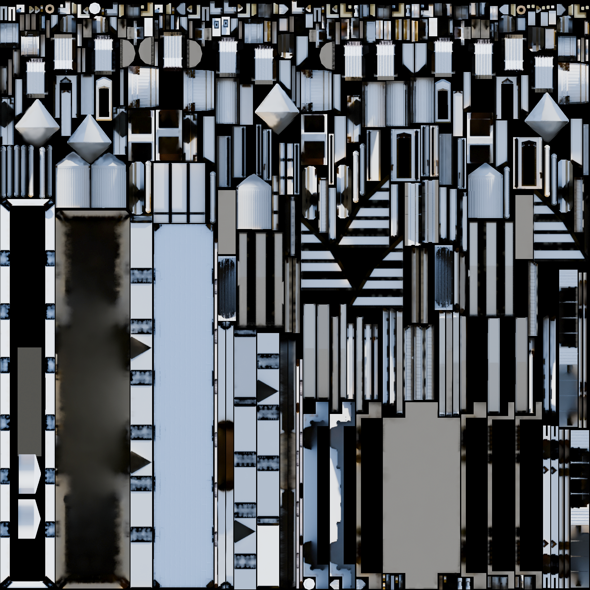
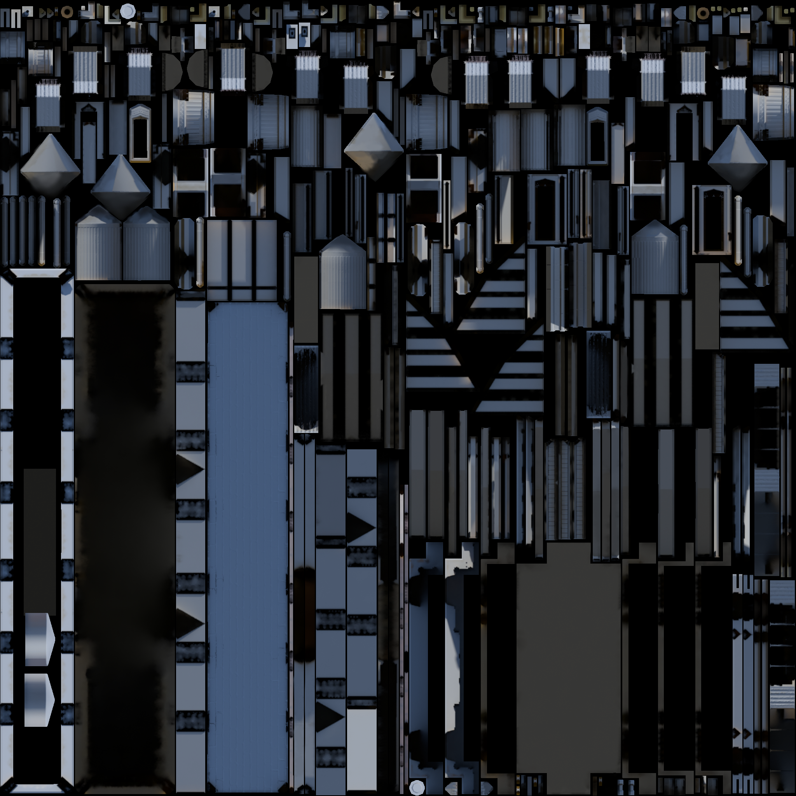
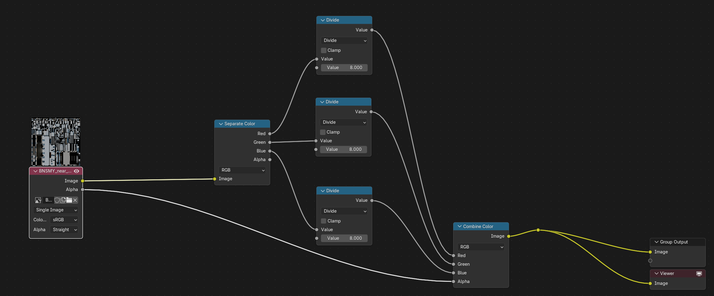

# Baking
## *Image Texture*
In order for the bakes to appear, we need an image where it can store that baking information. This is done through the material nodes. At the top, you will see a bunch of separate tabs. What you’re likely on right now is **Layout**, and we need to go to **Shading**. This will prompt up the material properties menu. Beware that the settings used in other tabs will not transfer, so you may be seeing everything gray again, so use the same method said in **Getting Started**.

Under the node menu, press **Shift + A > Texture > Image Texture** and click on **New**. A **New Image** prompt will pop up. Here you get to choose the size of the bake image. The most common in Smash Ultimate is 2K (2048x2048) and other powers of 2, but don’t be afraid of choosing odd numbers. Do whatever you want, really, just make sure it’s higher than 1k for better baking quality.

Next, choose a name for the image. Let’s just call it **Bake1** and hit OK. With the image now stored in the Blender file, we have to copy this node over to every single material Fun, isn’t it?

> [!CAUTION]
> **Make sure the image texture node is selected in every material as well.**

If you are on Solid mode with textures enabled  - and if you aren’t you should - the mesh should just turn black. Don’t worry, it’s normal. This is because Solid mode goes for the selected image rather than what is plugged onto the Texture node. This is why Solid mode is essential to see bakes in Blender rather than wasting time putting into Track Studio just for it to look wrong or have completely black spots (something very common with Ambient Occlusion baking). If you want to see your beautiful textures back, go into **Material Preview** mode that was previously mentioned.

## *UV Mapping*
Alright, we reached arguably the worst part about baking, so let’s go slowly step by step. Seriously, don’t rush this part.

### Second UV Map
First and foremost, we need a UV Map that will process the bake. On the menu on the right, click on the icon        . This will show a lot of separate tabs but the only one we need is the **UV Maps** tab. It most likely is going to only show one, which is the UV Map holding your normal mesh texture, so we need to add a second one by clicking the plus sign. We can call it **bake1**. Now do this to every single mesh and make sure the UV Maps all have the same name and **that bake UV Map is selected in every mesh as well**. It’s not necessary to click the camera icon, just needs to be selected.

If you already have a second UV Map for the second col layer for `uvmap` or for something else, the `bake1` UV map has to be the second one.

### UV Packing
There’s two ways to go around this, one Sm5sh style and the other which is less Sm5sh-y but works well when you’re doing a port, but before we do that, we need to clarify a few things missing.

* If you feel like there’s too many objects and faces to bake that it won’t look good fitting in all one texture, don’t worry, you can use more than one baking image. Just make sure the ones you have selected and want to bake have the exact same baking image applied. Collections telling which mesh has which bake helps a ton.
* If you have small triangles/polygons in your bake that are very small, they won’t bake if they’re smaller than 1 pixel in the image. To combat this, you can try using **Seams** by pressing **Ctrl + E > Mark Seam** on an edge. These seams tell Blender to separate UV islands on that edge, which will help Blender understand your mesh more clearly, and once you UV Unwrap it again, it will look nice and won’t leave any leftover small polygons hanging.

With those out of the way, read all of these options carefully to find what suits best for your needs.

### UV Packer (Add-on)
Let’s talk about add-ons. You can learn how to install add-ons [here](https://www.youtube.com/watch?v=LzdoUTvAgXk).

The most common and most useful add-on for what we’re trying to do is **UV Packer**. It’s perfect because it’s free! You can download it here: [UV-Packer for Blender](https://www.uv-packer.com/blender/). Follow the steps that the page provides to install the add-on successfully.

After the installation, go on the UV Editor and press **N**. A menu will pop up on the right with a new **UV-Packer** tab. All you need to do is select the corresponding image size and a big enough **padding**, something like 8 should work, select every UV island and hit **Pack**. This should give out a good arrangement of UV Islands, but as always, you can change the position however you please, although try to not change the position of any vertice, change **ONLY** the position of a UV island as a whole.

### Smart UV Projection
I wouldn’t recommend this, because your bakes should have the same UV islands as your main UV map, but it’s a decent option when you are porting from another game. Select every mesh with the same baking image and go to **Edit Mode** (press TAB), and select everything. Hit **U > Smart UV Project**. A small pop-up will appear, with additional settings. **Island Margin** is how separated each UV island will be. This shouldn’t be at 0, but also not too far off, so 0.001-0.005 is enough. **Angle Limit** depends on the type of mesh, but generally 30º is fine.

Going on the **UV Editing** tab, should give you a result similar to this:

<figure>
    
    <figcaption style="text-align: center;">Testing</figcaption>
</figure>

Yes, it’s all jumbled up and messy, but don’t worry, bakes are like that. You are allowed to scale some islands if you find they’re too small, which Smart UV projection often gives (which is why I don’t recommend this method much). You can also check if islands should be bigger or smaller based on the mesh, which is easy with **UV Sync Selection**, or this icon in the top left corner in the UV Editor:         . It just syncs your UV selection with the normal model selection so you can determine which face is which.

While on the same method, there is a different way to go about it, and that is doing the same thing but **per object**. You can then place your object’s islands in whatever place you like to see them baked, and continue with the same process until you fill the whole image. This process, while tedious, gives you more control over which meshes should be prioritized more on the bake.

## *Compositing*
In Smash Ultimate, since the RGB values are multiplied by 8.0 in order to store higher lighting intensities in a 8 bit texture, that means that the texture we have baked will need to be divided by 8.0 to match what the devs use. Not doing this will cause the stage scene to be too bright and not reflect what you have in the scene.

Here's an example of what you can expect to happen once we finish compositing the file. On the left, we see what Smash Ultimate devs originally had baked for `BNSMY_near_building01_bake_lit.nutexb` and on the right what is used in-game.

| Original | Edit (in-game) |
| :--- | :--- |
|  |  |

First, we’ll need to move to the compositing section on the top bar right next to the Rendering Tab.

*Insert image here*

From here, click on the **New** button and you should have a new Compositor node shown here.

Next, press **Shift+A > Search > Image**. After that, click the  icon and search for the baked lighting texture of your choosing. Next, you’ll need to create a few nodes:

**Separate Color**
* You will connect the Image Node image pointer to the image part of Separate Color. 

**Create 3 Divide Math Nodes**
* Each one will divide the RGB channels by 8. Connect the **Red**, **Green**, and **Blue** pointers to each Divide’s Value node pointer. Set the Value under it by 8.

**Combine Color**
* Connect the Divide RGB nodes to the Combine Color nodes.
* If you are using the alpha node in order to occlude or mask the lighting on shadows, you can also connect the alpha channel if you’d like.

**Group Output & Viewer**
* This should already be in your setup so connect the Combine Color node to the pointer. 

To recap, here’s what the order should look like:

**Image > Separate Color > 3 Divide > Combine Color > Group Output/Viewer**

<figure>
    
    <figcaption style="text-align: center;"><strong>Figure 8.8</strong>: Node Setup</figcaption>
</figure>

After this, you should see a far darker texture on the Image Editor preview which is ok because that’s what we are going for. If the white outline doesn’t cover the size of the texture, that means that resolution size doesn't match the image texture. To fix this, go to the top right in the Properties section and change the resolution size in the section and under format, change the size to what the image texture is using. 

When everything looks good. Go to the Image Window editor and press **Shift+Alt+S**. From there, make sure that you have these settings when saving:
* Media Type: **Image**
* File Format: **PNG** (.png)
* Color: **RGBA** (RGB is fine if there you aren’t using alpha)
* Compression: **0%**