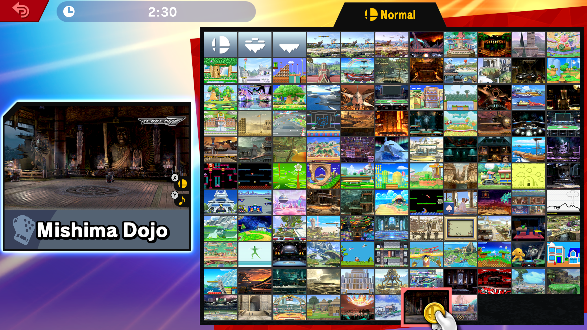
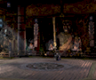
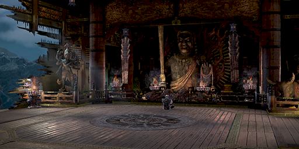
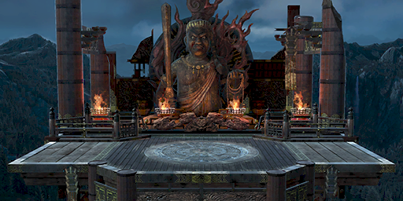
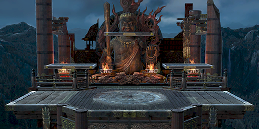

# Stage UI

## Stage Preview



The Stage user interface in Smash Ultimate has many components that you should keep in mind if you were to modify the files. Here's some of the key components that you should keep in mind:

| UI Element | Preview | Description |
| :--- | :--- | :--- |
| **stage_0** |  | Series Logo (The series icon found on the top right of the stage preview) |
| **stage_1** |  | Small Portrait (The icon when you hover over a stage in the stage select) |
| **stage_2** |  | Normal Portrait |
| **stage_3** |  | Omega Portrait |
| **stage_4** |  | Battlefield Portrait |
| **nam_stg1** |  | Stage Name. You can find this in `ui/message/msg_name.msbt` |

You can find these stage files located here:
```
ui/replace/stage/stage_# - for Normal stages
ui/replace_patch/stage/stage_# - for DLC/Patch stages
```

> [!IMPORTANT]
> Like other regional files in Smash Ultimate, some stages such as Smashville may also use regional names based on their language `(eg. stage_2_animal_village+us_en.btnx)`. If you are interested in having the file set to a specific language, refer to the table below.

| Language | Language Code |
|---------|---------|
|Japanese|jp_ja|
|English (US)|us_en|
|French (US)|us_fr|
|Spanish (US)|us_es|
|English (EU)|us_en|
|French (EU)|eu_fr|
|Spanish (EU)|eu_es|
|German (EU)|eu_de|
|Dutch (EU)|us_en|
|Italian (EU)|eu_it|
|Russian (EU)|eu_en|
|Korean|kr_ko|
|Chinese (China)|zh_cn|
|Chinese (Taiwan)|zh_tw|


## Stage UI Parameters

You can also change the appearance and/or sereis icon of a stage slot by modifying the `ui_stage_db.prc` file located here:

```
ui/param/database/ui_stage_db.prc
```

This prc file allows you to modify the stage order, decide whether it uses the album selector like Battlefield and Final Destination, and more. Here's the list of what each param does.

| Param | Description |
|---------|---------|
| ui_stage_id     | ID for stage UI.     |
| ui_series_id    | ID for the stage's sereies mark icon.      |
| stage_place_id    | ID for where you load the stage.      |
| secret_stage_place_id     | ID for the secret stage.      |
| secret_command_id     | The button that is used to press the secret stage.      |
| secret_command_id_joycon     | The button that is used to press the secret stage on a joy-con.     |
| bgm_set_id     | The Background Music series playlist for the stage.     |
| dlc_chara_id     | The DLC character ID    |
| name_id    | Name of the stage. This is stored in the nam_stg1 msbt section     |
| save_no     | The save number for the game's save data.     |
| can_select     | Allows the stage to be selected on the stage select.     |
| can_demo     | Allows the stage to appear in demo mode on the title screen.     |
| is_8player_stage     | Allows a stage to appear in the fourth rotation of the demo mode in the tile screen (note that the demo player count can only be six).     |
| is_usable_flag     | Determines if it can be used in VR mode.     |
| is_usable_amiibo     | Determines if it can be selectable on amiibo Journey.     |
| bgm_selector     | Determines whether it uses the album selector when selcting music on a stage.     |
| is_dlc     | Determines if the stage is DLC in the game.     |
| is_patch     | Determines if the stage is patched in the game.     |
| disp_order     | Display order on the stage select.     |
| bgm_setting_no     | Playlist ordreing for a stage's music playlist.     |

> [!TIP]
> [Smash Ultimate Tools](https://smashultimatetools.com/index.php?page=prcStage&id=prcStage) is the easiest way to modify the `ui_stage_db.prc` file although some of the params shown here may not be present. You can use [prcEditor](https://github.com/benhall-7/paracobNET) in case if there's something that's missing on the website.